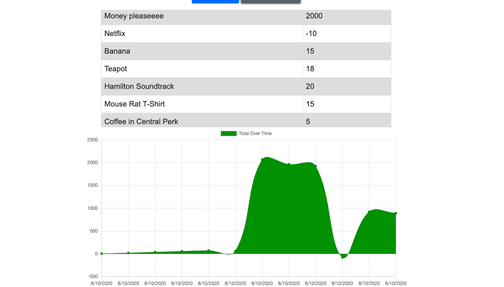

# **Online/Offline Budget Tracker**

This super fun and functional app allows peeps to add expenses and deposits to their budget with or without a connection. When entering transactions offline, they should populate the total when brought back online. Perfect for travelling!

## Table of contents

- [Description](#Description)
- [Installation](#Installation)
- [Usage](#Usage)
- [Link](#Links) 
- [Licenses](#Licenses)
- [Contributors](#Contributors)
- [Test](#Test)
- [GitHub Info](#GitHub) 

## Description
         This app uses a Javascript, Node, Express, MongoDB, Mongoose and IndexedDB.

## Installation

        npm install 

## Usage

        AS AN avid traveller
        I WANT to be able to track my withdrawals and deposits with or without a data/internet connection
        SO THAT my account balance is accurate when I am traveling 

## Link

- [Deployed App in Heroku](https://boiling-brushlands-46623.herokuapp.com/)

## Licenses

## Contributors

## Test

Tests: done and pass with flying colors.

## GitHub

- [GitHub Profile](https://github.com/paulinalo22)
